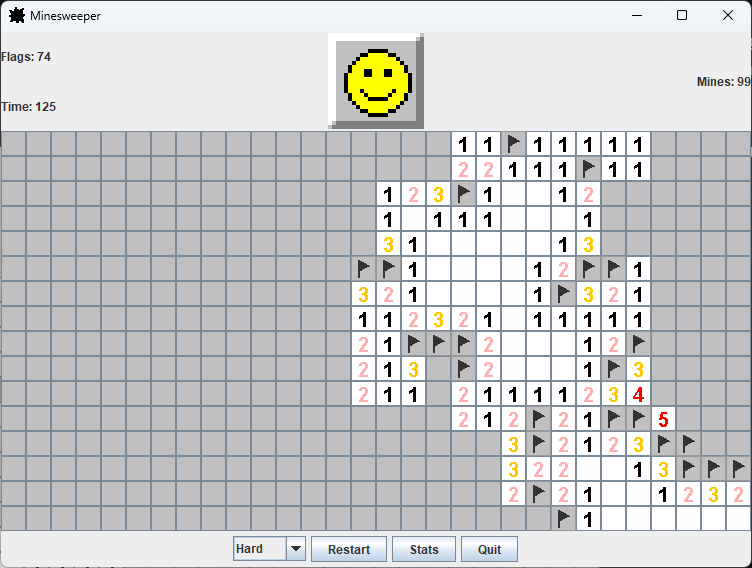

# Minesweeper 
## Description
This project is my personal recreation of the original minesweeper game using Java and Swing 

## Structure
### Board
The Board class holds the basic matrix including the mines and numbers
### Displaying the Board
The DisplayBoard handles all the logic of the game as well as the GUI
The grid is formed of Jbuttons that all have event listeners that handle what that tile should do
### Players
Each of the players are in there own class files with their own logic and can be created and used on a board separately however the GameRunner class will create a specified player and run the game on two separate threads to make the testing process easier 
## Controls
Right Click: Flag cell
Left Click: Reveal cell
Face Icon/Restart Button: Restarts Game
Difficulty Dropdown: Restarts game on selected difficulty
Stats Button: Will open stats screen (Not implemented)
Quit Button: Exits Game

