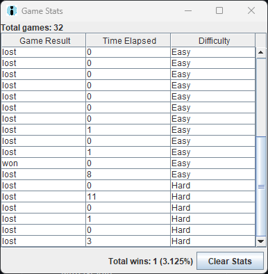

# Minesweeper 
## Description
This project is my personal recreation of the original minesweeper game using Java and Swing 

## Structure
### Board
The Board class holds the basic matrix including the mines and numbers
### Displaying the Board
The DisplayBoard handles all the logic of the game as well as the GUI

The grid is formed of JButtons that all have event listeners that handle what that tile should do
### Players
Each of the players is in their own class files with their own logic and can be created and used on a board separately 
### GameRunner
This class when with the start function will run both a GUI and a specified bot player and allowing easy restarts with one key to see the progress of the bot

## Stats
A function located in DisplayBoard will display the stats of each game when ran, it does not discriminate between bot and human player.
The stats are saved in a file called stats.txt and will be loaded in the stats screen (shown below).

## Controls
Right Click: Flag cell

Left Click: Reveal cell

Face Icon/Restart Button: Restarts Game

Difficulty Dropdown: Restarts game on selected difficulty

Stats Button: Will open stats screen (Just Implemented!)

Quit Button: Exits Game

R: Will restart game and current bot player (if bot player is run using GameRunner Class)

